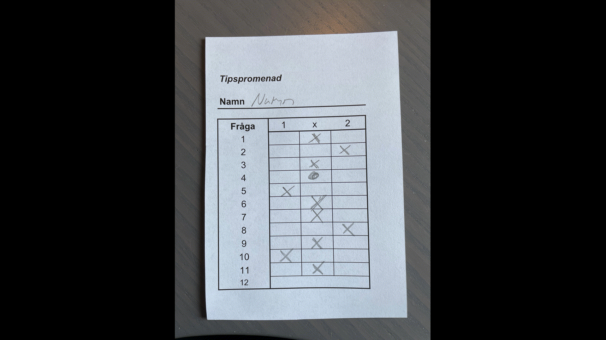

# auto-quiz

Scan quiz-sheets and automatically count correct answers. The script works in three steps: 
1. Process the image, find answer sheet and mask it. 
2. Finds the squares where answers are marked.
3. Finds marks and check if they are correct. 

### Settings:
| variable name   | type    | description |
| -------------   | ------- | ------------|
| correct_answers | list    | list with the correct option for each question |
| out_path        | path    | this is where images will be stored if save_im or out_im is set to True      |
| save_im | bool | save images that show the analyzing process    |
| out_im  | bool | save image with correct and wrong answers marked |
| blur    | int  | how much the image will be blured before finding lines, higher value --> faster

